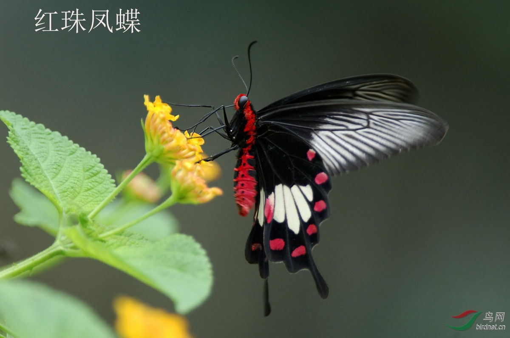

# 红珠凤蝶

## 红珠凤蝶 

### 凤蝶科珠凤蝶属 

### 翅展
70~94 mm

### 形态
红珠凤蝶后翅的白色斑有小斑、多斑、大斑、U形斑等多种型。

### 别名
红腹凤蝶，七星凤蝶，红纹曙凤蝶，红纹凤蝶。

## 分布范围

### 国内分布
河北、河南、陕西、江西、湖南、浙江、广西、四川、云南、福建、海南、台湾、香港

### 国外分布
印度、缅甸、泰国、马来西亚、印尼、菲律宾等国