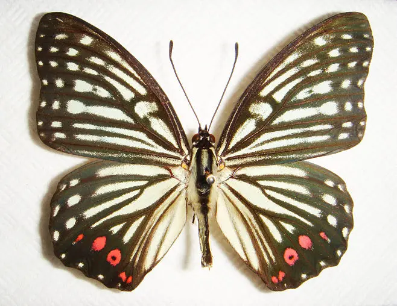

# 黑脉峡蝶

## 黑脉峡蝶

### 蛱蝶科  脉蛱蝶属

### 翅展
70~93mm

### 形态
翅面淡灰绿色，翅脉黑褐色，每一翅室有灰绿色斑和灰黑色小点。后翅外缘有淡黑色月牙斑。

### 寄主
榆科的朴树。

## 分布范围

### 国内分布
在福建、黑龙江、辽宁、甘肃、河北、山西、陕西、山东、河南、湖北、浙江、江苏、江西、湖南、台湾、广东、广西、四川、云南、西藏

### 国外分布
朝鲜，日本等。